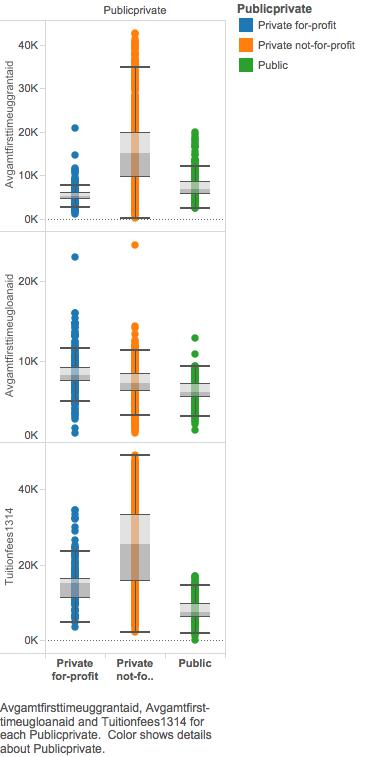
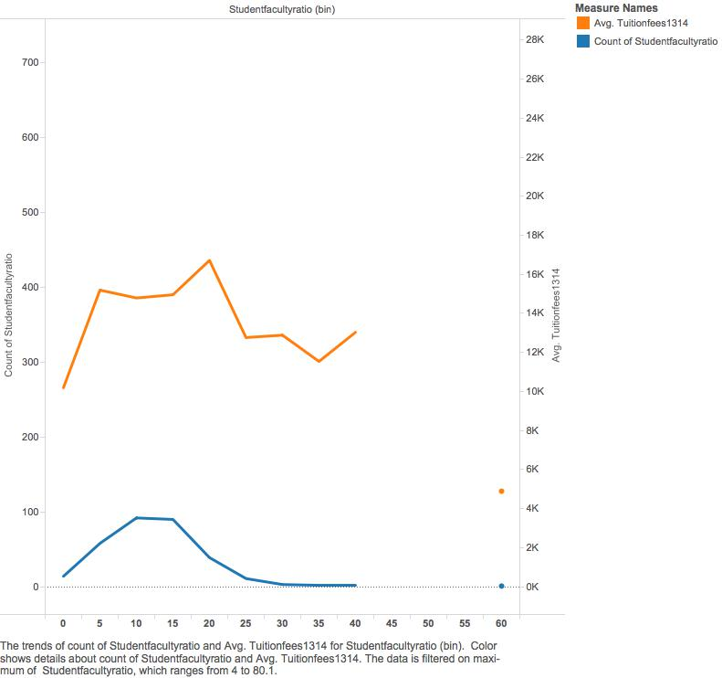
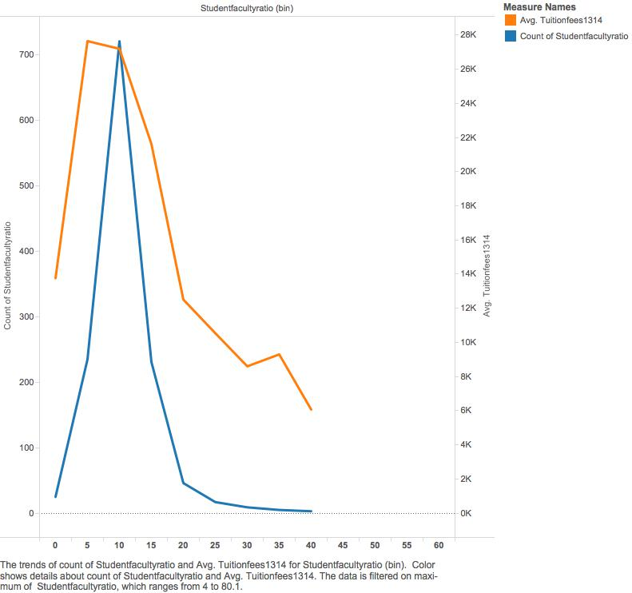
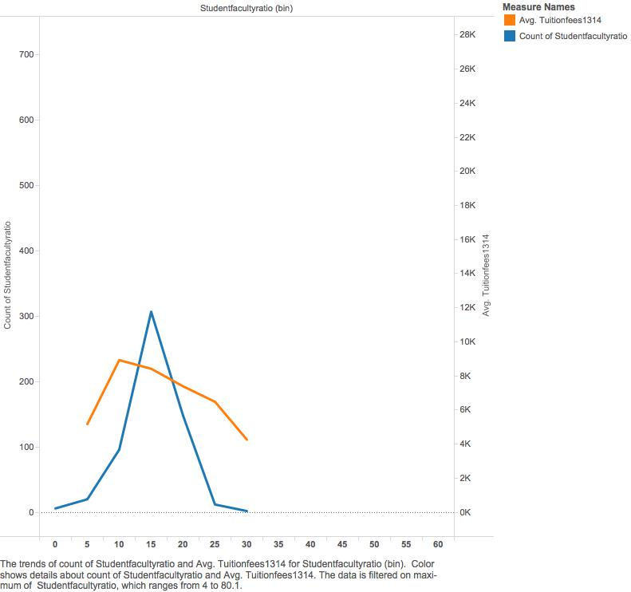
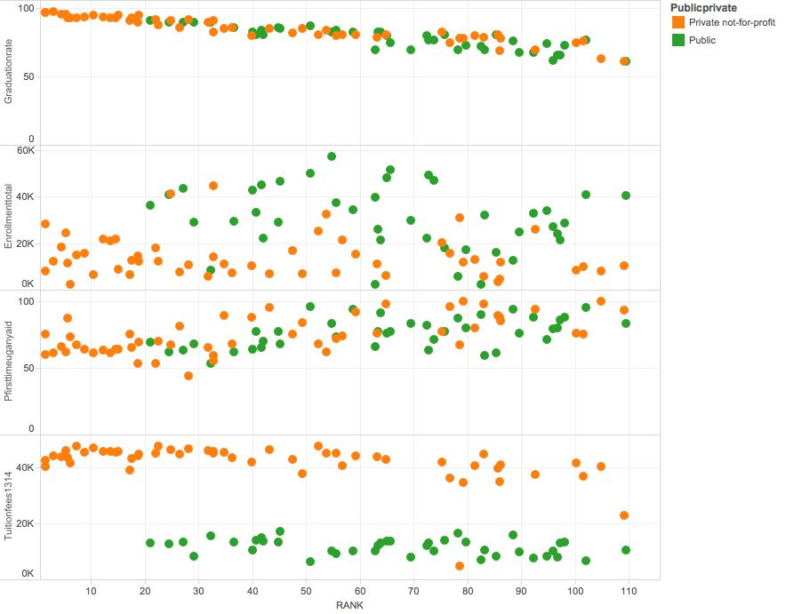

For analysis we are using a database of college financial aid data from the 2013-2014 school year, made available through the US Department of Education College Affordability and Transparency Center. Additionally, some analysis will be done on the top ranked colleges in the U.S. in comparison with financial aid data. 

###Reproducing Our Work:
1. Create a GitHub repository for the project.
2. Create the folders for project.
3. Find a csv file for statistical comparisons. Our CSV file was found on data.gov. Link: http://collegecost.ed.gov/catc/Default.aspx
4. Clean up CSVs using ETL file.
4. Import CSVs into SQL Developer.
5. Visualize data in R using code included below.
6. Package and publish app to shiny free application.

###SHINY URL: https://garnervincent.shinyapps.io/FinalProject

###Required Packages
```{r, echo=TRUE}
source("../require.R")
```

###Summary and Subset
```{r, echo=TRUE}
source("./summary.r", echo=TRUE)
```

##Working Through The Methodology

####1: Non-Aggregated Mesures - "Start with a Green Thing"

Box Plot
The first thing we wanted to do with this data is compare tuition costs across all colleges in the United States versus loan aid and grant aid.

Boxplot shows avergae first time undergraduate loan aid, first time undergraduate grant aid, and tuition and fees grouped by the type of college (public/private non-profit/private for-profit).





We wanted to delve a little deeper, so we created a bar chart breaking down the types of loan and grant aids that students can receive. Additionally, there is a reference line which shows the average tutition and fees for the type of college.

###Plot #1: Bar Chart with Reference Line
This bar chart compares average grant values given by each university type.  The reference line shows you the average tuition of those university types to demonstrate how much comes out of pocket or by other forms of loans.  We can see Private not-for-profit universities provide the most institutional grant money.  We can also see that the smallest gap to the reference line is shown in Public schools inferring that they will have the smallest out of pocket expense for most students.  We can also see that the state and federal grant amouts are the same for each university type. 

Questions Raised by Data:
1. Why are Private not-for-profit schools providing the most money?
2. Are public schools really the least out of pocket money?


https://garnervincent.shinyapps.io/FinalProject

###Reproducing the work:
The barchart was originally produced in tableau and replicated in R. See the following repository for that work: https://github.com/garnerv/DV_FinalProject. In this project, the shiny package was used along side the appropriate R code in the 'server.R' and 'require.R' files in order to create the shiny reactive application. 

First, the dataframe is created with a SQL call to the server to pull out the collegiate data. Piping using R code is then done to mutate the data and produce a more interesting plot. DF4 is created as an object using an inner join to the prior created data frames. Finally, GGplot is used with the render plot function to create the plot. The object is reactive so that when the button, 'Click me' is clicked as designated as click1 in the ui.r file.


##Histograms

#####Private for Profit


#####Private not for profit


#####Public



##2 Green Things - Scatter


#####Private for Profit


#####Private Not for Profit


#####Public


Thse scatterplots explore trends between graduation rates and average pell grants given to first time undergarduate students. For profit shows the highest (negative) correlation between the two variables. There is not enough information to show a significant correlation in the private not for profit or public school trends. We decided to explore something a little different for our shiny application.

###Plot #2: Scatter Plot

https://garnervincent.shinyapps.io/FinalProject

There are two highly interesting things about this data. We see that students receiving pell grants in the highest percentile are attending schools that have lower tuition and fees across all school types. Also, we can see that in the case of both groups of private schools, students receiving in the highest quartile of pell grants are attending schools with higher average student faculty ratios. This is on trend with the previously shown histograms, which show that you will, on average, pay more for a lower student faculty ratio.


###Reproducing the work:
The scatterplot set was originally produced in tableau and replicated in R. See the following repository for that work: https://github.com/garnerv/DV_FinalProject. In this project, the shiny package was used along side the appropriate R code in the 'server.R' and 'require.R' files in order to create the shiny reactive application. 

First, a dataframe is created using a SQL call to the server to pull the collegiate data out of SQL developer. DFS2 is created as a reactive object so that when the button click button is clicked, the graph is created. The dfs2 object is called in the ggplot function because it contains the data.


##Blue Things
###Plot #3: Crosstab w/ KPI
Our crosstab compares average tuition by university type in buckets of graduation rate precentiles.  The graduation rate is broken down into 'high', 'medium', and 'low'.  The KPI sliders adjust the tuition in those columns.  They are also broken down by university type.  There is an interesting corrolation between tuition and graduation rate.  It shows that those that pay more in tuition have a high graduation rate. The same is shown in most bucket values. This seems rather straightforward.

Questions Raised by Data:
1. Why do institutions with high tuition have high graduation rates?
2. Why doesn't this show up in all KPI bucket values?


https://garnervincent.shinyapps.io/FinalProject

###Reproducing the work:
The crosstab was originally produced in tableau and replicated in R. See the following repository for that work: https://github.com/garnerv/DV_FinalProject. In this project, the shiny package was used along side the appropriate R code in the 'server.R' and 'require.R' files in order to create the shiny reactive application. 

The crosstab is first loaded into an object with the server call that pulls in the appropriate data frame in line 13 of 'server.r'. KPI low max and KPI medium max are then created as slider objects in line 16 and 17 of 'server.r'. In line 19, the output is rendered into output$distPlot1. Layers for various parts of the plot are applied using the ggplot2 package. 'Plot' in line 54 calls the plot. Line 57 is an observing function to count the number of clicks the user initiates.

Note about the plot:
The KPI is initialized at the following values: The max low KPI is set at 30, while the max medium KPI is set at 70, and anything higher is coded as "high". You may adjust the values using the shiny sliders.

##Joining Datasets
Here we joined our original college financial aid information with another data set that provided the top rankings of 109 U.S. Universities, as ranked by usnews. The dataset represents rankings over an average of 6 years. There are no private for profit colleges in this list.

With it we showed 4 different scatterplots. 

Questions Raised by Data:
1. What is with those lines?
2. Why is there the drop off in the percentiles?

###Plot #4: Join


https://garnervincent.shinyapps.io/FinalProject


###Reproducing the work:
The scatterplot was originally produced in tableau and replicated in R. See the following repository for that work: https://github.com/garnerv/DV_FinalProject. In this project, the shiny package was used along side the appropriate R code in the 'server.R' and 'require.R' files in order to create the shiny reactive application. 

First, a dataframe is created using a SQL call to the server to pull the collegiate data out of SQL developer. DFS2 is created as a reactive object so that when the button click button is clicked, the graph is created. The dfs2 object is called in the ggplot function because it contains the data.
