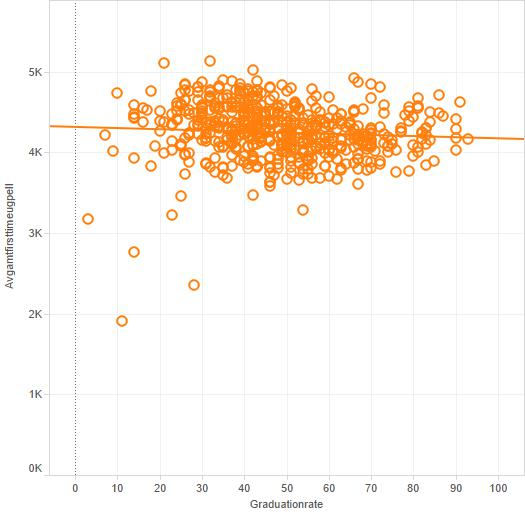

For analysis we are using a database of medical data containing information on the cost of some common medical procedures. 

###Reproducing Our Work:
1. Create a GitHub repository for the project.
2. Create the folders for project.
3. Find a csv file for statistical comparisons. Our CSV file was found on data.gov. Link: https://data.cms.gov/Medicare/Inpatient-Prospective-Payment-System-IPPS-Provider/97k6-zzx3
4. Import CSV into SQL Developer.
5. Visualize data in R using code included below.
6. Package and publish app to shiny free application.

###Required Packages
```{r, echo=TRUE}
source("../require.R",  echo = TRUE)
```

###Plot #1: Crosstab w/ KPI
Our crosstab compares average tuition by university type in buckets of graduation rate precentiles.  The graduation rate is broken down into 'high', 'medium', and 'low'.  The KPI sliders adjust the tuition in those columns.  They are also broken down by university type.  There is an interesting corrolation between Private not-for-profit tuition and graduation rate.  It shows that those that pay more in tuition have a high graduation rate. The same is shown in Public schools but not as drastically. This seems rather straightforward until you look at Private for-profit universities and you don't see the same correlation.

Questions Raised by Data:
1. Why do Private not-for-profit and Public institutions have high graduation rates for their high tuition?
2. Why do Private for-profit not have the same correllation?


###Reproducing the work:
The crosstab was originally produced in tableau and replicated in R. See the following repository for that work: https://github.com/garnerv/DV_FinalProject. In this project, the shiny package was used along side the appropriate R code in the 'server.R' and 'require.R' files in order to create the shiny reactive application. 

The crosstab is first loaded into an object with the server call that pulls in the appropriate data frame in line 13 of 'server.r'. KPI low max and KPI medium max are then created as slider objects in line 16 and 17 of 'server.r'. In line 19, the output is rendered into output$distPlot1. Layers for various parts of the plot are applied using the ggplot2 package. 'Plot' in line 54 calls the plot. Line 57 is an observing function to count the number of clicks the user initiates.

Note about the plot:
The KPI is initialized at the following values: The max low KPI is set at 30, while the max medium KPI is set at 70, and anything higher is coded as "high". You may adjust the values using the shiny sliders.


###Plot #2: Bar Chart with Reference Line
This bar chart compares average grant values given by each university type.  The reference line shows you the average tuition of those university types to demonstrate how much comes out of pocket or by other forms of loans.  We can see Private not-for-profit universities provide the most institutional grant money.  We can also see that the smallest gap to the reference line is shown in Public schools inferring that they will have the smallest out of pocket expense for most students.  We can also see that the state and federal grant amouts are the same for each university type. 

Questions Raised by Data:
1. Why are Private not-for-profit schools providing the most money?
2. Are public schools really the least out of pocket money?


###Reproducing the work:
The barchart was originally produced in tableau and replicated in R. See the following repository for that work: https://github.com/garnerv/DV_FinalProject. In this project, the shiny package was used along side the appropriate R code in the 'server.R' and 'require.R' files in order to create the shiny reactive application. 

First, the dataframe is created with a SQL call to the server to pull out the collegiate data. Piping using R code is then done to mutate the data and produce a more interesting plot. DF4 is created as an object using an inner join to the prior created data frames. Finally, GGplot is used with the render plot function to create the plot. The object is reactive so that when the button, 'Click me' is clicked as designated as click1 in the ui.r file.

###Plot #3: ScatterPlot
I don't know if I should talk about the plots you made in Tableau or the ones that are in shiny...

Questions Raised by Data:
1. What is with those lines?
2. Why are the public university values so close together?




###Reproducing the work:
The scatterplot was originally produced in tableau and replicated in R. See the following repository for that work: https://github.com/garnerv/DV_FinalProject. In this project, the shiny package was used along side the appropriate R code in the 'server.R' and 'require.R' files in order to create the shiny reactive application. 

First, a dataframe is created using a SQL call to the server to pull the collegiate data out of SQL developer. DFS2 is created as a reactive object so that when the button click button is clicked, the graph is created. The dfs2 object is called in the ggplot function because it contains the data.

###Plot #4: Join
Here we joined with another data set that provided the top rankings of American Universities. With it we showed 4 different scatterplots to find correllation. There is a direct positive correlation to graduation rate and university ranking.  A negative correllation with respect to financial aid received by each student on average.  There is not much correllation for enrollment and ranking. Then there is positive correllation for Private not-for-profit tuition and ranking but not much for Public tuition. 

Questions Raised by Data:
1. What is with those lines?
2. Why is there the drop off in the percentiles?


###Reproducing the work:
The scatterplot was originally produced in tableau and replicated in R. See the following repository for that work: https://github.com/garnerv/DV_FinalProject. In this project, the shiny package was used along side the appropriate R code in the 'server.R' and 'require.R' files in order to create the shiny reactive application. 

First, a dataframe is created using a SQL call to the server to pull the collegiate data out of SQL developer. DFS2 is created as a reactive object so that when the button click button is clicked, the graph is created. The dfs2 object is called in the ggplot function because it contains the data.
